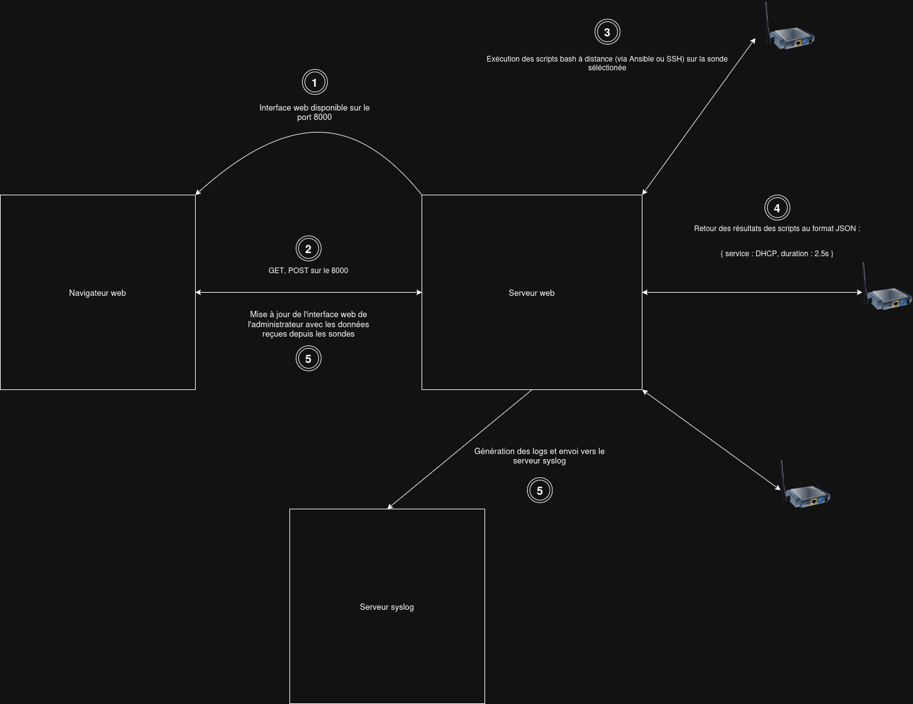

Contributor: Abdeldjallil Benziane, Anthony Busson, Thomas Begin 


## 1. Context and Motivation

The problem to be solved is particularly complex: it consists in combining several Quality of Service (QoS) measurements without performing active tests, thus avoiding the consumption of resources dedicated to network users. (By active measurement, we consider throughput tests that aim to measure the maximum available bandwidth by injecting a very large number of packets into the network.)

Wi-Fi networks, widely deployed in enterprises, campuses, and public areas, often remain the only way to access the Internet. However, the Wi-Fi protocol does not provide Quality of Service guarantees by design. Based on a fairness model, it attempts to distribute resources among stations, but remains highly sensitive to the radio environment and interference.

To address these issues, several solutions are implemented (dense deployment of access points, intelligent channel allocation, etc.). Nevertheless, system and network administrators lack tools to prove that the expected Quality of Service has actually been delivered. They often cannot determine whether a problem originates from the user side (poorly configured station, AP out of range) or from the provider side (temporary network unavailability).

---

## 2. Requirements and Metrics

To address this issue in a passive way from a station (in order to faithfully reproduce the user experience), several key metrics have been selected:

* **Channel Busy Time:** Fundamental metric representing the percentage of time during which the radio channel is occupied. Since Wi-Fi relies on a shared medium (unlike Full-Duplex Ethernet), each station must wait until the channel is free before transmitting. A high channel occupation rate increases latency and decreases throughput.
* **Transmit and Receive Modulation (MCS):** Determines the amount of information transmitted over a given time interval. It continuously evolves according to signal quality.
* **RSSI (Received Signal Strength Indicator):** Used to evaluate the received signal power.

---

## 3. Measurement Implementation and Methodology

### Channel Occupancy Measurement

Under Linux, the `iw` package is used to interact with wireless interfaces and extract cumulative activity times (listening, occupation, transmission, reception) since system startup.

To measure channel occupancy over a specific interval, a script performs a first measurement at time $t_1$, followed by a second measurement at the end of the interval ($t_2$).

Definition of time deltas between $t_1$ and $t_2$:

* $A$: Difference of the *channel active time* ($A_{t2} - A_{t1}$)
* $B$: Difference of the *channel busy time* ($B_{t2} - B_{t1}$)
* $R$: Difference of the *channel receive time* ($R_{t2} - R_{t1}$)
* $T$: Difference of the *channel transmit time* ($T_{t2} - T_{t1}$)

---

### Hardware (Chipset) Adaptation

Wireless chipset manufacturers compute these values differently:

**1. MediaTek MT7921 Wireless Card (Laptop)**

The card differentiates between frames addressed to the station (*receive time*) and frames not addressed to it (*busy time*). Therefore, the global occupation rate ($BT$) is:

$$BT = \frac{T + R + B}{A} \times 100$$

**2. Compex WLE900VX Card (Qualcomm Atheros QCA9880 / Ath10k Firmware)**

The *busy time* is slightly higher than the *receive time*, meaning that the card does not differentiate between both values (the *busy time* already includes reception). The adapted calculation is:

$$BT = \frac{T + B}{A} \times 100$$

---

## 4. Software Architecture and Automation

The objective was to design a lightweight, efficient, and easily deployable graphical interface.

### Technology Stack

* **Backend (Python / Flask):** Provides a REST API, centralizes business logic, and orchestrates scripts.
* **Automation (Ansible):** Integrated into the backend to manage configurations, guarantee idempotency, and parallelize script execution on remote monitoring nodes.
* **Frontend (HTML / Alpine.js / Chart.js):** A lightweight interface dynamically updated. Alpine.js manages reactivity with minimal overhead, while Chart.js provides real-time monitoring graph rendering.

---

## 5. REST API Endpoints

The web interface communicates with the backend through the following endpoints:

| Method | URL | Parameters / Body | Expected Response (JSON) |
| :--- | :--- | :--- | :--- |
| GET | `/hosts` | - | List of monitoring nodes from the Ansible inventory. |
| GET | `/wifi/status` | `probe`, `interface` | Wireless interface status. |
| GET | `/scan` | `signal`, `probe`, `interface` | List of BSSID/SSID above the threshold. |
| GET | `/wifi/monitor/start` | `probe`, `interface`, `interval` | Monitoring stream (Busy Time, Idle Time, MCS, Signal, BSSID). |
| GET | `/wifi/monitor/stop` | `probe`, `interface` | Confirmation of monitoring stop. |

---

## 6. File Structure and Description

### Client Side (monitoring nodes)

```text
client/
├── appli/
│   ├── dns_check                  # DNS resolution
│   ├── http_check                 # HTTP/HTTPS access
│   ├── icmp_check                 # ICMP connectivity and latency
│   ├── ip_check_config            # Active IP configuration
│   └── wireless_bandwidth_check   # Bandwidth test
├── autorun                        # Automatic test sequence
├── config.cfg                     # Default autorun parameters
└── wireless/
    ├── monitoring/
    │   ├── get_infos              # Continuous radio metrics collection
    │   └── get_status             # Current connection status
```

### Server Side
```text
server/
└── webapp/
    ├── app.py                     # Flask server, API, and Ansible/Syslog orchestration
    ├── Dockerfile                 # Image definition
    ├── docker-compose.yml         # Service declaration
    ├── ansible.cfg                # Local Ansible configuration
    ├── ansible-client/            # SSH keys, inventories, variables (extravars)
    │   ├── templates/autorun.j2   # Client configuration template
    │   └── *-playbook.yml         # Orchestration playbooks (scan, start-monitor, etc.)
    ├── deploy-client-configuration.yml # Global client deployment playbook
    ├── index.html                 # Main web interface
    ├── style.css                  # Visual styles
    ├── script/                    # Frontend JS (alpine.js, chart.js, script.js)
    ├── install/                   # requirements.txt, DHCP hooks
    └── uploads/creds.csv          # Storage of uploaded Wi-Fi credentials
```

---


