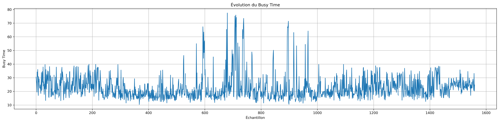
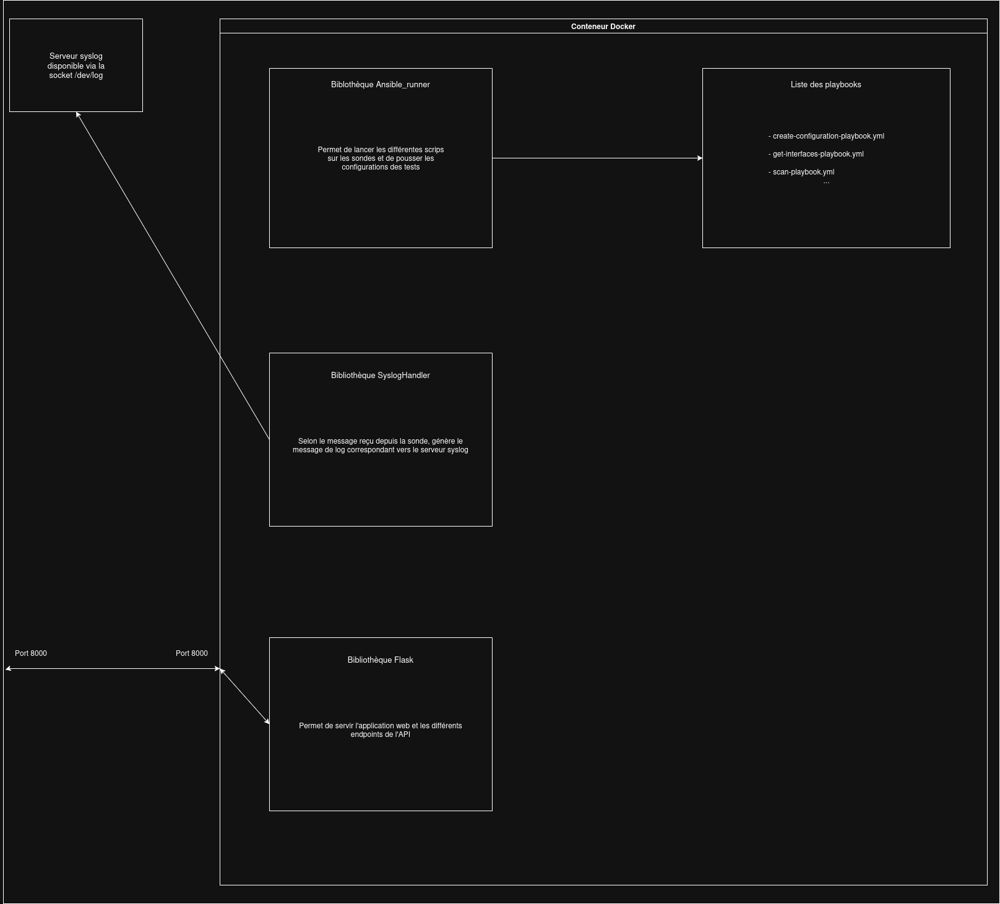

# Documentation de l'Outil de Monitoring Wi-Fi

## 1. Contexte et Motivation

Le problème à résoudre est particulièrement complexe : il s'agit de combiner plusieurs mesures de qualité de service (Qualité de service) sans effectuer de tests actifs, évitant ainsi de consommer des ressources destinées aux utilisateurs du réseau. (Par mesure active, nous considérons les tests de débit qui visent à mesurer la bande passante maximale disponible en injectant un nombre très important de paquets dans le réseau).

Les réseaux Wi-Fi, largement déployés dans les entreprises, campus et lieux publics, demeurent souvent le seul moyen d'accéder à Internet. Cependant, le protocole Wi-Fi ne garantit pas la qualité de service par conception. Basé sur un modèle d'équitabilité, il tente de répartir les ressources entre les stations, mais reste très sensible à l'environnement radio et aux interférences. 

Pour pallier ces problèmes, des solutions sont mises en œuvre (déploiement dense de points d'accès, allocation intelligente des canaux, etc.). Néanmoins, les administrateurs systèmes et réseaux manquent d'outils pour prouver que la Qualité de service a bien été rendue. Il leur est souvent impossible de déterminer si un problème provient de l'utilisateur (station mal configurée, AP hors de portée) ou du fournisseur (indisponibilité ponctuelle du réseau).

---

## 2. Besoins et Métriques

Pour répondre à cette problématique de manière passive depuis une station (afin de simuler fidèlement l'expérience utilisateur), plusieurs métriques clés ont été retenues :

* **Le Taux d'occupation du lien (Channel Busy Time) :** Métrique fondamentale représentant le pourcentage de temps durant lequel le canal radio est occupé. Le Wi-Fi reposant sur un médium partagé (contrairement à l'Ethernet Full-Duplex), chaque station doit attendre que le canal soit libre pour émettre. Un taux d'occupation élevé entraîne une hausse de la latence et une baisse du débit.
* **La Modulation (MCS) en émission et réception :** Détermine la densité d'informations transmises sur un intervalle de temps. Elle évolue constamment selon la qualité du signal.
* **Le RSSI (Received Signal Strength Indicator) :** Permet d'évaluer la puissance du signal reçu.

---

## 3. Implémentation et Méthodologie de Mesure

### Mesure des temps d'occupation
Sous Linux, le paquet `iw` est utilisé pour interagir avec les interfaces sans fil et extraire les temps d'activité (écoute, occupation, transmission, réception) cumulés depuis le démarrage. 

Pour mesurer le taux d'occupation sur un intervalle précis, un script effectue une première mesure à un instant $t_1$, puis une seconde à l'issue de l'intervalle ($t_2$). 

Définition des deltas de temps entre $t_1$ et $t_2$ :
* $A$ : Différence du *channel active time* ($A_{t2} - A_{t1}$)
* $B$ : Différence du *channel busy time* ($B_{t2} - B_{t1}$)
* $R$ : Différence du *channel receive time* ($R_{t2} - R_{t1}$)
* $T$ : Différence du *channel transmit time* ($T_{t2} - T_{t1}$)

### Adaptation selon le matériel (Chipsets)

Les constructeurs calculent ces valeurs différemment :

**1. Carte MediaTek MT7921 (PC Portable)**
La carte différencie les trames qui lui sont destinées (*receive time*) de celles qui ne le sont pas (*busy time*). Le calcul du taux d'occupation global ($BT$) en pourcentage est donc :
$$BT = \frac{T + R + B}{A} \times 100$$

**2. Carte Compex WLE900VX (Qualcomm Atheros QCA9880 / Firmware Ath10k)**
Le *busy time* est légèrement supérieur au *receive time*, signifiant que la carte ne différencie pas les deux (le *busy time* inclut déjà la réception). Le calcul adapté est :
$$BT = \frac{T + B}{A} \times 100$$


Exemple de mesure du busy time avant, pendant et après une pause :




### Estimation de la Bande Passante Résiduelle
L'interface de surveillance n'émettant que des paquets de gestion (Probes) avec la modulation la plus basse, une injection ponctuelle de trafic léger (ex: ping) est nécessaire pour mettre à jour le MCS et obtenir le débit théorique maximal actuel.

La bande passante résiduelle estimée se calcule ainsi :
$$Estimated\_Throughput = \left(1 - \frac{BT}{100}\right) \times MCS$$

---

## 4. Architecture Logicielle et Automatisation

L'objectif était de concevoir une interface graphique légère, performante et facilement déployable.

### Stack Technologique
* **Backend (Python / Flask) :** Expose une API REST, mutualise la logique métier et orchestre les scripts.
* **Automatisation (Ansible) :** Intégré au backend pour gérer les configurations, garantir l'idempotence et paralléliser l'exécution des scripts sur les sondes distantes.
* **Frontend (HTML / Alpine.js / Chart.js) :** Interface épurée mise à jour dynamiquement. Alpine.js gère la réactivité de manière très légère, et Chart.js assure le rendu des graphiques de monitoring en temps réel.

### Journalisation et Preuve de Qualité de service (Syslog)
Afin de conserver une preuve de la Qualité de service, des tests unitaires automatisés (HTTP, DNS, ICMP) sont exécutés à intervalles réguliers. 
Les sondes envoient les résultats au serveur Flask au format JSON. Le serveur formate ces données en messages Syslog et leur attribue un niveau de sévérité :
* `INFO` : Opération réussie.
* `WARNING` : Lenteur détectée (ex: association prenant entre 4s et 15s).
* `ERROR` : Échec complet de l'opération.
Ces logs permettent d'isoler les causes de dysfonctionnement, de la couche Liaison aux couches Applicatives.

### Conteneurisation
L'application est conteneurisée avec **Docker** (image base `python:3.10-slim`) pour garantir une compatibilité totale et une installation simplifiée. Un fichier `docker-compose.yml` gère le mappage des ports et le montage des volumes (notamment pour relier le socket syslog du conteneur à l'hôte).





---

## 5. Endpoints de l'API Rest

L'interface web communique avec le backend via les endpoints suivants :

| Méthode | URL | Paramètres / Body | Réponse attendue (JSON) |
| :--- | :--- | :--- | :--- |
| **GET** | `/hosts` | - | Liste des sondes de l'inventaire Ansible. |
| **GET** | `/hosts/interfaces` | - | Liste des interfaces de chaque sonde. |
| **GET** | `/wifi/status` | `sonde`, `interface` | État de l'interface (associé, authentifié ou non). |
| **GET** | `/scan` | `signal`, `sonde`, `interface` | Liste des BSSID/SSID dont le signal dépasse le seuil. |
| **POST** | `/bssid/configuration` | `bssid`, `sonde`, `ssid` | Confirmation du déploiement de la configuration. |
| **POST** | `/bssid/configuration/send`| Fichier CSV `SSID,WPA-TYPE,CREDS` | Confirmation du déploiement des identifiants Wi-Fi. |
| **GET** | `/bssid/events` | `sonde`, `interface` | Statut et durée de l'authentification/association. |
| **GET** | `/ip/events` | `sonde`, `interface` | Statut, durée, IP et Gateway de la requête DHCP. |
| **GET** | `/wifi/monitor/start` | `sonde`, `interface`, `interval` | Flux régulier (Busy Time, Idle Time, MCS, Signal, BSSID). |
| **GET** | `/wifi/monitor/stop` | `sonde`, `interface` | Confirmation de l'arrêt du monitoring. |
| **POST** | `/speedtest` | `sonde`, `interface`, `bwp` (cible) | Résultats de BP, latence, gigue et perte de paquets. |
| **POST** | `/autorun` | Config complète (interval, cibles...)| Confirmation du déploiement de l'Autorun. |
| **GET** | `/events` | `sonde` | Logs générés à la suite de l'autorun. |
| **POST** | `/reset` | `sonde`, `interface` | Confirmation de la réinitialisation réseau. |

---

## 6. Structure et Description des Fichiers

### Côté Client (Sondes)
```text
client/
├── appli/
│   ├── dns_check                  # Résolution DNS
│   ├── http_check                 # Accès HTTP/HTTPS
│   ├── icmp_check                 # Connectivité et latence ICMP
│   ├── ip_check_config            # Configuration IP active
│   └── wireless_bandwidth_check   # Test de bande passante
├── autorun                        # Enchaînement auto des tests
├── config.cfg                     # Paramètres par défaut de l'autorun
├── install.sh                     # Préparation de l'environnement client
└── wireless/
    ├── configuration/
    │   ├── files/                 # Templates (WPA-EAP, WPA-PSK) et source creds.csv
    │   └── script/                # Scripts de scan BSSID et création de conf
    ├── monitoring/
    │   ├── get_infos              # Collecte continue des métriques radio
    │   └── get_status             # État de la connexion courante
    ├── reset/
    │   └── reset_config           # Réinitialisation état réseau
    └── tu/
        ├── association_check      # Association via wpa_supplicant
        └── ip_config_request      # Requête DHCP
```

### Côté Serveur
```text
server/
└── webapp/
    ├── app.py                     # Serveur Flask, API et orchestration Ansible/Syslog
    ├── Dockerfile                 # Définition de l'image
    ├── docker-compose.yml         # Déclaration du service
    ├── ansible.cfg                # Configuration locale Ansible
    ├── ansible-client/            # Clés SSH, Inventaires, Variables (extravars)
    │   ├── templates/autorun.j2   # Template de conf client
    │   └── *-playbook.yml         # Playbooks d'orchestration (scan, start-monitor, etc.)
    ├── deploy-client-configuration.yml # Playbook global de déploiement client
    ├── index.html                 # Interface Web principale
    ├── style.css                  # Styles visuels
    ├── script/                    # JS Frontend (alpine.js, chart.js, script.js)
    ├── install/                   # requirements.txt, hooks DHCP
    └── uploads/creds.csv          # Stockage des credentials Wi-Fi uploadés
```

---


