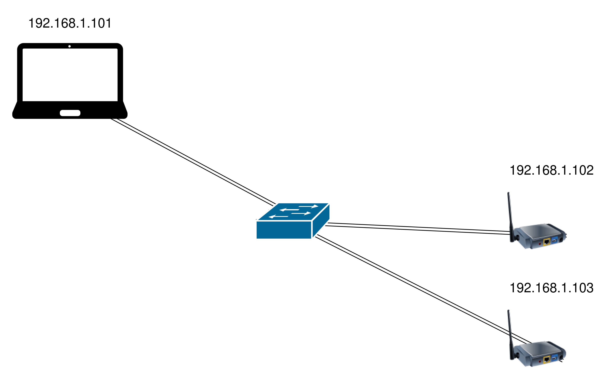

# Installation - Wi-Fi Watch 

This document explains how to install the complete project:
- `/server/webapp/` (web interface + Flask API + Ansible orchestration)
- `/client/` (measurement scripts deployed on monitoring probes)

## 1. Prerequisites

### Monitoring Server

- Linux (Debian/Ubuntu recommended)
- Docker + Docker Compose plugin
- Ansible (for the initial deployment of monitoring probes)
- SSH access to monitoring probes
- Active local syslog server (rsyslog recommended), with `/dev/log` socket available

### Probes (Client Machines)

- Debian strongly recommended
- Available Wi-Fi interface
- SSH access authorized from the server
- A Linux user on the probe with the ability to become root
- IP address of the probe
- Wired connection between the monitoring server and the probe



## 2. Retrieve the Project

```bash
git clone <repository-url>
cd wirelessmonitoring
```
## 3. Configure Ansible (Inventory + SSH Key)

Modify the following file:

```bash
/server/webapp/ansible-client/inventory/inventory.yml
```

Choose the probe name (here, raspberry) and specify the correct IP address.

Minimal example:
```yaml
all:
  children:
    probes:
      vars:
        monitoring_user: "monitoring"
        ansible_ssh_public_key_file: "./keys/id_rsa_ansible.pub"
        ansible_ssh_private_key_file: "./keys/id_rsa_ansible"
      hosts:
        raspberry:
          ansible_host: X.X.X.X
          ansible_user: "{{ monitoring_user }}"
```

